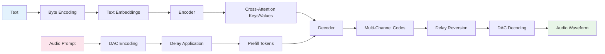

# Dia TTS Model: Architecture and Workflow Analysis

## Overview

Dia is a neural text-to-speech (TTS) system that converts text to natural-sounding speech using an encoder-decoder transformer architecture with audio codec integration. The system uses byte-level text encoding, multi-channel audio generation with delay patterns, and DAC (Descript Audio Codec) for high-quality audio synthesis.

**Note**: This analysis covers the inference implementation. The Dia repository contains pre-trained models and inference code optimized for production deployment.

## Model Architecture

### Core Components

The Dia model consists of several key components working together:

#### 1. DiaModel ([`layers.py`](dia/layers.py))
The main neural network module that handles:
- **Text Encoding**: Converts byte-level text to embeddings
- **Audio Generation**: Synthesizes multi-channel audio codes
- **Cross-Attention**: Conditions audio generation on text representations

**Key Submodules:**
- [`Encoder`](dia/layers.py:591): Transformer encoder for text processing
- [`Decoder`](dia/layers.py:730): Transformer decoder for audio generation
- [`DenseGeneral`](dia/layers.py:16): JAX-compatible linear layers with tensor operations
- [`RotaryEmbedding`](dia/layers.py:95): RoPE positional encoding

#### 2. Dia ([`model.py`](dia/model.py))
High-level interface that handles:
- **Text Processing**: Byte-level encoding and padding
- **Audio Prompt Management**: DAC encoding/decoding for conditioning
- **Generation Loop**: Autoregressive audio token generation
- **DAC Integration**: Audio codec for waveform synthesis

#### 3. Configuration System ([`config.py`](dia/config.py))
Comprehensive configuration management:
- [`EncoderConfig`](dia/config.py:21): Text encoder parameters
- [`DecoderConfig`](dia/config.py:57): Audio decoder parameters  
- [`DiaConfig`](dia/config.py:103): Master configuration with delay patterns

#### 4. Audio Processing ([`audio.py`](dia/audio.py))
Delay pattern management for multi-channel audio:
- [`build_delay_indices`](dia/audio.py:6): Precompute delay transformations
- [`apply_audio_delay`](dia/audio.py:44): Apply channel delays during generation
- [`revert_audio_delay`](dia/audio.py:125): Remove delays for final output

#### 5. State Management ([`state.py`](dia/state.py))
Inference state tracking:
- [`EncoderInferenceState`](dia/state.py:43): Text processing state
- [`DecoderInferenceState`](dia/state.py:120): Audio generation state with KV caches
- [`KVCache`](dia/state.py:72): Efficient attention caching

## Detailed Workflow

### Data Flow Summary



### 1. Text Preprocessing and Encoding

```
Input Text → Byte Encoding → Padding → Text Embeddings
```

**Process:**
1. **Byte-Level Encoding**: Text converted to UTF-8 bytes with special token replacement
2. **Padding**: Sequences padded to maximum encoder length (1024 tokens)
3. **Embedding**: Byte tokens converted to dense representations

**Code Flow:**
```python
# In Dia._encode_text()
byte_text = text.encode("utf-8")
replaced_bytes = byte_text.replace(b"[S1]", b"\x01").replace(b"[S2]", b"\x02")
text_tokens = list(replaced_bytes)
return torch.tensor(text_tokens[:max_len], dtype=torch.long, device=self.device)
```

### 2. Audio Prompt Processing

**Audio Prompt Preparation**:
```python
# In Dia._prepare_audio_prompt()
# DAC encoding of audio prompt
encoded_prompt = self._encode(audio_prompt)  # Shape: [T, C]

# Add BOS token and apply delay pattern
prefill[:, 0, :] = audio_bos_value  # BOS token
prefill[i, 1:prompt.shape[0] + 1, :] = prompt  # Audio codes

# Apply channel delays
delayed_batch = apply_audio_delay(prefill, pad_value=-1, bos_value=audio_bos_value, precomp=delay_precomp)
```

**Delay Pattern Application**:
- **Purpose**: Enables parallel generation while maintaining causal dependencies
- **Pattern**: `[0, 8, 9, 10, 11, 12, 13, 14, 15]` - Channel 0 has no delay, others delayed by 8-15 steps
- **Benefit**: Allows efficient multi-channel audio generation

### 3. Encoder Processing

```
Byte Tokens → Embeddings → Multi-Head Attention → Layer Norm → MLP → Text Representations
```

**Location**: [`Encoder.forward()`](dia/layers.py:612) - Processes both conditional and unconditional inputs

#### Step 3.1: Text Embedding and Attention
```python
# Text embedding
x = self.embedding(x_ids)  # [B, T, hidden_size]

# Multi-layer transformer processing
for layer in self.layers:
    x = layer(x, state)  # Self-attention + MLP

# Final normalization
x = self.norm(x).to(self.compute_dtype)
```

#### Step 3.2: Classifier-Free Guidance Setup
```python
# Prepare conditional and unconditional inputs
enc_input_uncond = torch.zeros_like(text)  # Empty text for CFG
enc_input_cond = text  # Actual text
stacked_inputs = torch.stack([enc_input_uncond, enc_input_cond], dim=1)
enc_input = stacked_inputs.view(2 * batch_size, -1)  # [2*B, T]
```

### 4. Decoder Processing (Autoregressive Generation)

```
Audio Tokens → Multi-Channel Embeddings → Self-Attention → Cross-Attention → MLP → Next Token Logits
```

**Location**: [`Decoder.decode_step()`](dia/layers.py:784) - Single-step generation with KV caching

#### Step 4.1: Multi-Channel Token Embedding
```python
# Sum embeddings across all audio channels
x = None
for i in range(self.num_channels):
    channel_tokens = tgt_ids_Bx1xC[..., i]  # [B, 1]
    channel_embed = self.embeddings[i](channel_tokens)  # [B, 1, hidden_size]
    x = channel_embed if x is None else x + channel_embed
```

#### Step 4.2: Transformer Layers with Caching
```python
for i, layer in enumerate(self.layers):
    self_cache = state.self_attn_cache[i]  # KV cache for self-attention
    cross_cache = state.cross_attn_cache[i]  # KV cache for cross-attention
    x = layer(x, state, self_attn_cache=self_cache, cross_attn_cache=cross_cache, current_idx=current_idx)
```

#### Step 4.3: Multi-Channel Logit Generation
```python
# Generate logits for all channels simultaneously
x = self.norm(x)  # [B, 1, hidden_size]
logits_Bx1xCxV = self.logits_dense(x)  # [B, 1, num_channels, vocab_size]
```

### 5. Sampling and Generation Control

**Classifier-Free Guidance**:
```python
# Split conditional and unconditional logits
uncond_logits_BxCxV = logits_last_Bx2xCxV[:, 0, :, :]  # [B, C, V]
cond_logits_BxCxV = logits_last_Bx2xCxV[:, 1, :, :]    # [B, C, V]

# Apply CFG scaling
logits_BxCxV = cond_logits_BxCxV + cfg_scale * (cond_logits_BxCxV - uncond_logits_BxCxV)
```

**Advanced Sampling**:
```python
# Temperature, top-p, and top-k sampling
pred_BC = _sample_next_token(
    flat_logits_BCxV.float(),
    temperature=temperature,
    top_p=top_p,
    top_k=top_k,
    audio_eos_value=audio_eos_value,
)
```

### 6. Audio Synthesis (DAC Integration)

```
Generated Codes → Delay Reversion → DAC Decoding → Final Audio Waveform
```

**Process**:
1. **Delay Reversion**: Remove channel delays to restore temporal alignment
2. **DAC Decoding**: Convert discrete codes to continuous audio waveform
3. **Quality Control**: Clamp invalid codes and ensure proper sample rate

**Code Flow**:
```python
# Revert delay pattern
codebook = revert_audio_delay(generated_codes, pad_value=audio_pad_value, precomp=revert_precomp, T=seq_length)

# DAC decoding to waveform
audio_codes = codebook.unsqueeze(0).transpose(1, 2)  # [1, C, T]
audio_values, _, _ = self.dac_model.quantizer.from_codes(audio_codes)
audio_values = self.dac_model.decode(audio_values)  # Final 44.1kHz waveform
```

## Technical Architecture Details

### Model Components Breakdown

#### DenseGeneral ([`layers.py:16`](dia/layers.py:16))
- **Purpose**: JAX-compatible linear transformations with flexible axis contractions
- **Architecture**: Uses `torch.tensordot` for generalized matrix multiplication
- **Input**: Arbitrary tensor shapes with specified contraction axes
- **Output**: Transformed tensors maintaining JAX compatibility

#### RotaryEmbedding ([`layers.py:95`](dia/layers.py:95))
- **Purpose**: Rotary positional encoding for transformer attention
- **Architecture**: Sine/cosine position encoding applied to query/key vectors
- **Benefits**: Better length extrapolation and relative position modeling

#### Multi-Head Attention with GQA ([`layers.py:345`](dia/layers.py:345))
- **Self-Attention**: Causal masking for autoregressive generation
- **Cross-Attention**: Text-to-audio conditioning
- **GQA Support**: Grouped Query Attention for efficiency
- **KV Caching**: Optimized inference with cached key-value pairs

### Key Innovations

#### 1. Multi-Channel Audio Generation with Delay Patterns
```python
# Delay pattern: [0, 8, 9, 10, 11, 12, 13, 14, 15]
delay_pattern = self.config.delay_pattern
delayed_batch = apply_audio_delay(audio_BxTxC, pad_value=-1, bos_value=audio_bos_value, precomp=delay_precomp)
```
- **Purpose**: Enables parallel multi-channel generation while maintaining dependencies
- **Benefit**: Faster generation than sequential channel processing
- **Implementation**: Channel 0 generates first, others follow with increasing delays

#### 2. Byte-Level Text Encoding
```python
def _encode_text(self, text: str) -> torch.Tensor:
    byte_text = text.encode("utf-8")
    replaced_bytes = byte_text.replace(b"[S1]", b"\x01").replace(b"[S2]", b"\x02")
    text_tokens = list(replaced_bytes)
```
- **Purpose**: Language-agnostic text processing
- **Benefit**: Handles any UTF-8 text without language-specific tokenizers
- **Vocabulary**: 256 byte values (0-255)

#### 3. DAC Integration for High-Quality Audio
```python
# Encoding: Audio → DAC codes
_, encoded_frame, _, _, _ = self.dac_model.encode(audio_data)

# Decoding: DAC codes → Audio
audio_values, _, _ = self.dac_model.quantizer.from_codes(audio_codes)
audio_values = self.dac_model.decode(audio_values)
```
- **Purpose**: High-quality audio codec for neural audio generation
- **Sample Rate**: 44.1kHz output
- **Compression**: ~90x compression ratio with minimal quality loss

#### 4. Classifier-Free Guidance (CFG)
```python
# Dual forward pass: conditional and unconditional
logits_BxCxV = cond_logits_BxCxV + cfg_scale * (cond_logits_BxCxV - uncond_logits_BxCxV)
```
- **Purpose**: Improved text conditioning and controllability
- **Benefit**: Better adherence to text prompts with adjustable strength
- **Implementation**: Parallel processing of conditional and unconditional paths

## Usage Patterns

### Basic Usage
```python
from dia import Dia

# Initialize model
dia = Dia.from_pretrained("nari-labs/Dia-1.6B-0626")

# Generate speech
audio = dia.generate("Hello, world!")
dia.save_audio("output.wav", audio)
```

### Advanced Usage
```python
# Custom configuration
audio = dia.generate(
    text="Hello, world!",
    max_tokens=2048,
    cfg_scale=3.0,
    temperature=1.2,
    top_p=0.95,
    audio_prompt="path/to/reference.wav"  # Voice conditioning
)

# Batch generation
texts = ["Hello", "World", "How are you?"]
audios = dia.generate(texts)
```

### Production Deployment
```python
# Optimized for production
dia = Dia.from_pretrained(
    "nari-labs/Dia-1.6B-0626",
    compute_dtype="float16",  # Memory optimization
    device=torch.device("cuda"),
    load_dac=True
)

# Compiled generation (faster after warmup)
audio = dia.generate(text, use_torch_compile=True)
```

## Performance Characteristics

### Model Size and Speed
- **Parameters**: 1.6 billion (encoder + decoder)
- **Model Size**: ~3.2GB (float16)
- **Inference Speed**: ~2-5x real-time on modern GPUs
- **Memory**: ~8GB GPU memory for inference

### Quality Metrics
- **Sample Rate**: 44.1kHz
- **Bit Depth**: 16-bit equivalent (DAC compressed)
- **Latency**: ~100-500ms for short texts
- **Quality**: High-fidelity speech with natural prosody

### Computational Requirements
- **Training**: Not available (inference-only)
- **Inference**: GPU recommended, CPU supported
- **Memory Scaling**: Linear with sequence length and batch size

## Deployment Considerations

### Dependencies
- **Core**: PyTorch, transformers, huggingface_hub
- **Audio**: dac, torchaudio, soundfile
- **Configuration**: pydantic for validation
- **Utilities**: numpy for array operations

### Platform Support
- **Operating Systems**: Linux, macOS, Windows
- **Hardware**: CUDA GPUs, Apple Silicon (MPS), CPU
- **Precision**: float32, float16, bfloat16 support

### Production Deployment
```python
# Memory-optimized setup
dia = Dia.from_pretrained(
    model_name="nari-labs/Dia-1.6B-0626",
    compute_dtype="float16",
    device=torch.device("cuda"),
    load_dac=True
)

# Batch processing for efficiency
texts = ["Text 1", "Text 2", "Text 3"]
audios = dia.generate(texts, use_torch_compile=True)
```

### Configuration Management
```python
# Custom configuration
config = DiaConfig(
    encoder_config=EncoderConfig(hidden_size=1024, num_hidden_layers=12),
    decoder_config=DecoderConfig(hidden_size=2048, num_hidden_layers=18),
    delay_pattern=[0, 8, 9, 10, 11, 12, 13, 14, 15]
)
```

## Conclusion

Dia represents a modern approach to neural text-to-speech synthesis, leveraging transformer architectures with advanced techniques like classifier-free guidance, multi-channel generation with delay patterns, and high-quality audio codecs. The system's design prioritizes both audio quality and deployment efficiency, making it suitable for production applications requiring high-fidelity speech synthesis.

The combination of byte-level text encoding, sophisticated attention mechanisms, and DAC integration creates a robust pipeline capable of generating natural-sounding speech with fine-grained control over generation parameters. The modular architecture and comprehensive configuration system enable flexible deployment across various hardware platforms and use cases.