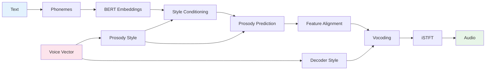

# Kokoro TTS Model: Architecture and Workflow Analysis

## Overview

Kokoro is a multilingual neural text-to-speech (TTS) system that converts text to natural-sounding speech across 9 different languages. The system uses a sophisticated pipeline combining phoneme-based text processing, neural acoustic modeling, and advanced vocoding techniques.

## Supported Languages

- **English**: American English (`a`) and British English (`b`)
- **Spanish**: `e` (es)
- **French**: `f` (fr-fr)
- **Hindi**: `h` (hi)
- **Italian**: `i` (it)
- **Japanese**: `j` (requires `misaki[ja]`)
- **Brazilian Portuguese**: `p` (pt-br)
- **Mandarin Chinese**: `z` (requires `misaki[zh]`)

## Model Architecture

### Core Components

The Kokoro model consists of several key components working together:

#### 1. KModel ([`model.py`](kokoro/model.py))
The main neural network module with 82 million parameters that handles:
- **Text Encoding**: Converts phonemes to embeddings
- **Prosody Prediction**: Predicts duration, F0 (pitch), and energy
- **Audio Generation**: Synthesizes waveform from acoustic features

**Key Submodules:**
- [`CustomAlbert`](kokoro/modules.py:180): BERT-based text encoder for contextual understanding
- [`ProsodyPredictor`](kokoro/modules.py:91): Predicts speech timing and prosodic features
- [`TextEncoder`](kokoro/modules.py:35): Processes phoneme sequences
- [`Decoder`](kokoro/istftnet.py:384): Generates audio waveform

#### 2. KPipeline ([`pipeline.py`](kokoro/pipeline.py))
Language-aware processing pipeline that handles:
- **G2P (Grapheme-to-Phoneme)**: Text to phoneme conversion
- **Voice Management**: Loading and caching voice embeddings
- **Text Chunking**: Splitting long texts for processing
- **Language-specific Processing**: Tailored handling per language

#### 3. Neural Vocoder ([`istftnet.py`](kokoro/istftnet.py))
Advanced vocoder architecture featuring:
- **Generator**: Converts acoustic features to audio
- **STFT-based Processing**: Uses Short-Time Fourier Transform
- **AdaIN (Adaptive Instance Normalization)**: Style conditioning
- **HiFi-GAN inspired architecture**: High-quality audio synthesis

#### 4. Custom STFT ([`custom_stft.py`](kokoro/custom_stft.py))
ONNX-compatible STFT implementation:
- **Forward STFT**: Time-domain to frequency-domain conversion
- **Inverse STFT**: Frequency-domain to time-domain reconstruction
- **Conv1D-based**: Avoids complex operations for better ONNX export

## Detailed Workflow

### Data Flow Summary



### 1. Text Preprocessing and G2P

```
Input Text → Language Detection → G2P Processing → Phonemes
```

**Process:**
1. **Language-specific G2P**: Each language uses specialized phonemizers
   - English: Uses [`misaki`](https://github.com/hexgrad/misaki) with espeak fallback
   - Other languages: espeak-ng based processing
2. **Text Chunking**: Long texts split into manageable segments (~400-510 characters)
3. **Phoneme Tokenization**: Convert phonemes to model input tokens

**Code Flow:**
```python
# In KPipeline.__call__()
if self.lang_code in 'ab':  # English
    _, tokens = self.g2p(graphemes)
    for gs, ps, tks in self.en_tokenize(tokens):
        # Process each chunk
else:  # Other languages
    ps, _ = self.g2p(chunk)
    # Direct phoneme processing
```

### 2. Voice Loading and Preparation

**Voice Loading Process**:
```python
# In KPipeline.load_voice()
pack = torch.load(voice_file, weights_only=True)
# Voice tensor shape: [256] where first 128 = decoder style, last 128 = prosody style
ref_s = pack.to(model.device)
```

**Voice Vector Split**:
- **Decoder Style**: `ref_s[:, :128]` - Controls vocoder characteristics
- **Prosody Style**: `ref_s[:, 128:]` - Controls timing, pitch, energy patterns

### 3. Neural Processing Pipeline (Complete Audio Generation)

```
Phonemes + Voice → Text Encoding → Style-Conditioned Prosody → Vocoding → Final Audio
```

**Location**: [`KModel.forward_with_tokens()`](kokoro/model.py:87) - **Single forward pass produces complete audio**

#### Step 3.1: Text Encoding with Style Conditioning
```python
# BERT processing
bert_dur = self.bert(input_ids, attention_mask=(~text_mask).int())
d_en = self.bert_encoder(bert_dur).transpose(-1, -2)
# d_en: BERT-encoded phoneme embeddings

# Extract prosody style vector
s = ref_s[:, 128:]  # Prosody conditioning vector [batch_size, 128]

# Apply style conditioning to text features
d = self.predictor.text_encoder(d_en, s, input_lengths, text_mask)
# d: Style-conditioned text features
```

#### Step 3.2: Prosody Prediction (Duration, F0, Energy)
```python
# LSTM processing
x, _ = self.predictor.lstm(d)
# x: LSTM output (bidirectional) [batch_size, seq_len, hidden_dim]

# Duration prediction
duration = self.predictor.duration_proj(x)
duration = torch.sigmoid(duration).sum(axis=-1) / speed
pred_dur = torch.round(duration).clamp(min=1).long()

# Create alignment matrix from predicted durations
indices = torch.repeat_interleave(torch.arange(input_ids.shape[1], device=device), pred_dur)
pred_aln_trg = torch.zeros((input_ids.shape[1], indices.shape[0]), device=device)
pred_aln_trg[indices, torch.arange(indices.shape[0])] = 1

# Align features for F0/Energy prediction
en = d.transpose(-1, -2) @ pred_aln_trg
# en: Duration-aligned text features

# F0 and Energy prediction (with style conditioning)
F0_pred, N_pred = self.predictor.F0Ntrain(en, s)
# F0_pred: Pitch contour, N_pred: Energy contour
```

#### Step 3.3: Audio Generation (Vocoding with iSTFT)
```python
# Align text encoder features
t_en = self.text_encoder(input_ids, input_lengths, text_mask)
asr = t_en @ pred_aln_trg  # Aligned text features

# Generate final audio (includes vocoding with iSTFT)
audio = self.decoder(asr, F0_pred, N_pred, ref_s[:, :128])
# Uses decoder style vector ref_s[:, :128]
```

**Vocoding Process Inside Decoder**:
1. **Harmonic Source Generation**: Creates periodic excitation for voiced sounds
2. **Noise Source Generation**: Creates aperiodic excitation for unvoiced sounds
3. **Style-Conditioned Processing**: AdaIN applied throughout generator with style vectors
4. **Spectral Feature Generation**: Neural network outputs magnitude + phase
5. **iSTFT Conversion**: Converts spectral features to final 24kHz waveform

**Final Output**: Complete styled audio waveform ready for playback

## Technical Architecture Details

### Model Components Breakdown

#### CustomAlbert ([`modules.py:180`](kokoro/modules.py:180))
- **Purpose**: Contextual text understanding
- **Architecture**: BERT-based transformer
- **Input**: Tokenized phonemes
- **Output**: Contextual embeddings

#### ProsodyPredictor ([`modules.py:91`](kokoro/modules.py:91))
- **Duration Encoder**: LSTM-based sequence modeling
- **F0 Predictor**: Pitch contour generation
- **Energy Predictor**: Loudness/energy modeling
- **Style Conditioning**: AdaIN-based style transfer

#### Generator ([`istftnet.py:257`](kokoro/istftnet.py:257))
- **Source Module**: Harmonic + noise excitation
- **Upsampling Layers**: Progressive resolution increase
- **ResBlocks**: Feature refinement with style conditioning
- **STFT Processing**: Spectral domain synthesis

### Key Innovations

#### 1. Adaptive Instance Normalization (AdaIN)
```python
class AdaIN1d(nn.Module):
    def forward(self, x, s):
        h = self.fc(s)
        gamma, beta = torch.chunk(h, chunks=2, dim=1)
        return (1 + gamma) * self.norm(x) + beta
```
- **Purpose**: Style conditioning throughout the network
- **Benefit**: Enables voice cloning and style transfer

#### 2. Custom STFT Implementation
```python
class CustomSTFT(nn.Module):
    def transform(self, waveform):
        # Conv1D-based STFT for ONNX compatibility
        real_out = F.conv1d(x, self.weight_forward_real, stride=self.hop_length)
        imag_out = F.conv1d(x, self.weight_forward_imag, stride=self.hop_length)
```
- **Purpose**: ONNX-compatible spectral processing
- **Benefit**: Enables deployment across platforms

#### 3. HiFi-GAN Inspired Vocoder
- **Multi-scale Processing**: Different temporal resolutions
- **Adversarial Training**: High-quality audio generation
- **Efficient Architecture**: 82M parameters total

## Usage Patterns

### Basic Usage
```python
from kokoro import KPipeline

# Initialize pipeline
pipeline = KPipeline(lang_code='a')  # American English

# Generate speech
for gs, ps, audio in pipeline(text, voice='af_heart'):
    # gs: graphemes (original text)
    # ps: phonemes 
    # audio: generated waveform (24kHz)
    pass
```

### Advanced Usage
```python
# Multi-language support
en_pipeline = KPipeline(lang_code='a')  # English
es_pipeline = KPipeline(lang_code='e')  # Spanish

# Custom voice blending
blended_voice = "af_heart,af_bella"  # Average multiple voices

# Speed control
pipeline(text, voice='af_heart', speed=1.2)  # 20% faster

# Custom model reuse
model = KModel()
pipeline1 = KPipeline(lang_code='a', model=model)
pipeline2 = KPipeline(lang_code='e', model=model)
```

### CLI Usage
```bash
# Basic synthesis
python -m kokoro --text "Hello world" -o output.wav --voice af_heart

# From file
echo "Hello world" > input.txt
python -m kokoro -i input.txt -o output.wav -l a --voice af_heart

# Different languages
python -m kokoro --text "Hola mundo" -o output.wav -l e --voice ef_dora
```

## Performance Characteristics

### Model Size and Speed
- **Parameters**: 82 million
- **Model Size**: ~330MB
- **Inference Speed**: Real-time on modern CPUs
- **GPU Acceleration**: CUDA and MPS (Apple Silicon) support

### Quality Metrics
- **Sample Rate**: 24kHz
- **Bit Depth**: 16-bit (for WAV output)
- **Latency**: Low-latency streaming capable
- **Quality**: Comparable to larger models (300M+ parameters)

### Memory Requirements
- **Model Loading**: ~1GB RAM
- **Voice Cache**: ~10MB per voice
- **Processing**: Scales with text length

## Deployment Considerations

### Dependencies
- **Core**: PyTorch, transformers, huggingface_hub
- **G2P**: misaki (with language-specific extras)
- **Audio**: espeak-ng for fallback and non-English languages

### Platform Support
- **Operating Systems**: Linux, macOS, Windows
- **Hardware**: CPU, CUDA GPUs, Apple Silicon (MPS)
- **Export Formats**: ONNX compatible (with custom STFT)

### Production Deployment
```python
# Optimized for production
pipeline = KPipeline(
    lang_code='a',
    device='cuda',  # Explicit device selection
    model=shared_model  # Reuse model across instances
)

# Batch processing
texts = ["Text 1", "Text 2", "Text 3"]
for text in texts:
    for result in pipeline(text, voice='af_heart'):
        # Process each result
        pass
```

## Conclusion

Kokoro represents a well-engineered TTS system that balances quality, efficiency, and multilingual support. Its modular architecture allows for flexible deployment while maintaining high audio quality through advanced neural vocoding techniques. The system's design prioritizes both ease of use and production readiness, making it suitable for a wide range of applications from research to commercial deployment.

The combination of BERT-based text understanding, sophisticated prosody modeling, and HiFi-GAN inspired vocoding creates a robust pipeline capable of generating natural-sounding speech across multiple languages with relatively modest computational requirements.