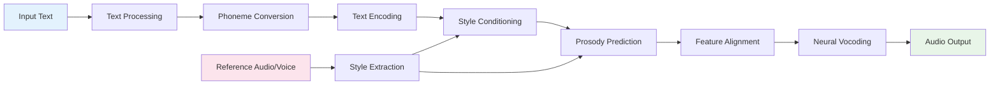

# Kokoro vs StyleTTS2: Detailed Comparison

## Shared Workflow Overview

Both Kokoro and StyleTTS2 follow a similar high-level TTS workflow, representing the standard neural text-to-speech pipeline:

### Common Pipeline Steps



### 1. Text Processing and Phonemization
- **Input**: Raw text in various languages
- **Process**: Convert text to phoneme sequences
- **Output**: Tokenized phonemes ready for neural processing

### 2. Text Encoding
- **Input**: Phoneme sequences
- **Process**: Neural encoding through embedding → CNN → LSTM architecture
- **Output**: Contextual text representations

### 3. Style Conditioning
- **Input**: Reference audio or voice embeddings
- **Process**: Extract and apply speaker/style characteristics
- **Output**: Style-conditioned features

### 4. Prosody Prediction
- **Input**: Style-conditioned text features
- **Process**: Predict duration, F0 (pitch), and energy contours
- **Output**: Prosodic parameters for natural speech timing

### 5. Feature Alignment
- **Input**: Text features and predicted durations
- **Process**: Align text features to acoustic timeline
- **Output**: Time-aligned acoustic features

### 6. Neural Vocoding
- **Input**: Aligned features and prosodic parameters
- **Process**: Generate waveform using neural vocoder
- **Output**: High-quality audio waveform

## Shared Components Analysis

### ISTFT-Net Vocoder Architecture

Both models share nearly identical ISTFT-Net implementations, indicating a common foundation:

#### Core Shared Classes

| Component | Kokoro Location | StyleTTS2 Location | Purpose |
|-----------|----------------|-------------------|---------|
| [`AdaIN1d`](kokoro/istftnet.py:20) | `kokoro/istftnet.py:20` | `styletts2/Modules/istftnet.py:15` | Adaptive Instance Normalization for style conditioning |
| [`AdaINResBlock1`](kokoro/istftnet.py:34) | `kokoro/istftnet.py:34` | `styletts2/Modules/istftnet.py:27` | Style-conditioned residual blocks |
| [`SineGen`](kokoro/istftnet.py:108) | `kokoro/istftnet.py:108` | `styletts2/Modules/istftnet.py:111` | Harmonic sine wave generation |
| [`SourceModuleHnNSF`](kokoro/istftnet.py:212) | `kokoro/istftnet.py:212` | `styletts2/Modules/istftnet.py:250` | Harmonic + noise source modeling |
| [`TorchSTFT`](kokoro/istftnet.py:80) | `kokoro/istftnet.py:80` | `styletts2/Modules/istftnet.py:83` | STFT/ISTFT operations |
| [`Generator`](kokoro/istftnet.py:257) | `kokoro/istftnet.py:257` | `styletts2/Modules/istftnet.py:302` | Main vocoder generator |

#### Shared Vocoder Features
- **Harmonic Modeling**: Both use [`SourceModuleHnNSF`](kokoro/istftnet.py:212) for periodic excitation
- **Noise Modeling**: Aperiodic excitation for unvoiced sounds
- **Style Conditioning**: [`AdaIN1d`](kokoro/istftnet.py:20) normalization throughout
- **STFT Processing**: Spectral domain synthesis with inverse STFT

#### Key Implementation Difference
- **Kokoro AdaIN1d**: Uses `affine=True` in InstanceNorm1d for ONNX compatibility
- **StyleTTS2 AdaIN1d**: Uses `affine=False` in InstanceNorm1d (standard implementation)

### Text Encoding Architecture

Both models implement similar text encoding patterns:

#### Shared Text Processing Components

| Component | Kokoro | StyleTTS2 | Shared Features |
|-----------|--------|-----------|----------------|
| [`TextEncoder`](kokoro/modules.py:35) | `kokoro/modules.py:35` | `styletts2/models.py:284` | Embedding → CNN → LSTM architecture |
| [`LayerNorm`](kokoro/modules.py:21) | `kokoro/modules.py:21` | `styletts2/models.py:270` | Layer normalization |
| [`LinearNorm`](kokoro/modules.py:11) | `kokoro/modules.py:11` | `styletts2/models.py:166` | Xavier-initialized linear layers |

#### Common Text Encoding Flow
```python
# Shared pattern in both models
x = self.embedding(phonemes)           # Phoneme embeddings
x = x.transpose(1, 2)                  # [B, T, emb] → [B, emb, T]
for cnn_layer in self.cnn:             # CNN processing
    x = cnn_layer(x)
x = x.transpose(1, 2)                  # [B, emb, T] → [B, T, emb]
x, _ = self.lstm(x)                    # Bidirectional LSTM
```

### Prosody Prediction Architecture

Both implement sophisticated prosody prediction with similar components:

#### Shared Prosody Components

| Component | Purpose | Kokoro | StyleTTS2 |
|-----------|---------|--------|-----------|
| [`ProsodyPredictor`](kokoro/modules.py:91) | Main prosody prediction | `kokoro/modules.py:91` | `styletts2/models.py:440` |
| [`DurationEncoder`](kokoro/modules.py:137) | Duration modeling | `kokoro/modules.py:137` | `styletts2/models.py:517` |
| [`AdaLayerNorm`](kokoro/modules.py:72) | Style-conditioned normalization | `kokoro/modules.py:72` | `styletts2/models.py:418` |
| [`AdainResBlk1d`](kokoro/istftnet.py:340) | 1D residual blocks with style | `kokoro/istftnet.py:340` | `styletts2/models.py:372` |

#### Common Prosody Prediction Flow
```python
# Shared prosody prediction pattern
d = self.text_encoder(texts, style, text_lengths, mask)    # Style-conditioned encoding
x, _ = self.lstm(d)                                        # LSTM processing
duration = self.duration_proj(x)                          # Duration prediction
F0_pred, N_pred = self.F0Ntrain(aligned_features, style)  # F0 and energy prediction
```

## Key Architectural Differences

### 1. Model Complexity and Scale

| Aspect | Kokoro | StyleTTS2 |
|--------|--------|-----------|
| **Parameters** | 82 million | 200+ million |
| **Model Size** | ~330MB | ~800MB+ |
| **Architecture** | Streamlined, efficient | Complex, research-grade |
| **Components** | Essential components only | Multiple specialized modules |

### 2. Training Methodology

#### Kokoro: Training Code Not Available
```python
# Note: The Kokoro repository contains only inference code
# Training methodology is not publicly available
# Repository includes: model.py, pipeline.py, modules.py, __main__.py, istftnet.py
```

#### StyleTTS2: Adversarial + Diffusion Training
```python
# Complex multi-component training
nets = Munch(
    generator=generator,
    mpd=MultiPeriodDiscriminator(),
    msd=MultiResSpecDiscriminator(), 
    wd=WavLMDiscriminator(),
    diffusion=AudioDiffusionConditional()
)

# Adversarial training loop
gen_loss = generator_loss + adversarial_loss + diffusion_loss
disc_loss = discriminator_loss
```

### 3. Style Modeling Approaches

#### Kokoro: Reference Audio Embeddings
- **Method**: Direct use of pre-computed voice embeddings
- **Storage**: Voice vectors cached as `.pt` files
- **Usage**: `ref_s[:, :128]` for decoder style, `ref_s[:, 128:]` for prosody style
- **Advantage**: Simple, efficient, fast inference

#### StyleTTS2: Learned Style Encoders
- **Method**: Neural networks extract style from reference audio
- **Architecture**: [`StyleEncoder`](styletts2/models.py:139) with 2D convolutions
- **Dual Encoders**: Separate acoustic and prosodic style extraction
- **Advantage**: More flexible, learnable style representations

### 4. Language Support Strategy

#### Kokoro: Multilingual Focus
```python
LANG_CODES = dict(
    # pip install misaki[en]
    a='American English',
    b='British English',

    # espeak-ng
    e='es',
    f='fr-fr',
    h='hi',
    i='it',
    p='pt-br',

    # pip install misaki[ja]
    j='Japanese',

    # pip install misaki[zh]
    z='Mandarin Chinese',
)

# Language-specific G2P processing
if lang_code in 'ab':
    self.g2p = en.G2P(trf=trf, british=lang_code=='b')
elif lang_code == 'j':
    self.g2p = ja.JAG2P()
elif lang_code == 'z':
    self.g2p = zh.ZHG2P()
```

#### StyleTTS2: English-Centric
- **Focus**: Primarily English language support
- **Architecture**: Optimized for English phonetics and prosody
- **Extensibility**: Would require significant modifications for other languages

### 5. Vocoder Options and Flexibility

#### Kokoro: ISTFT-Net Only
- **Single Vocoder**: ISTFT-Net implementation
- **Optimization**: Custom STFT for ONNX compatibility
- **Focus**: Deployment efficiency

#### StyleTTS2: Dual Vocoder Support
```python
# Flexible vocoder selection
if args.decoder.type == "istftnet":
    from Modules.istftnet import Decoder
elif args.decoder.type == "hifigan":
    from Modules.hifigan import Decoder
```
- **Options**: ISTFT-Net and HiFi-GAN
- **Trade-offs**: Quality vs. speed selection
- **Research**: Comparative vocoder studies

### 6. Advanced Features and Enhancements

#### Kokoro: Production-Ready Features
- **ONNX Export**: Custom STFT implementation for deployment
- **ONNX Compatibility**: `disable_complex` flag and modified AdaIN1d with `affine=True` for ONNX export
- **CLI Interface**: Ready-to-use command-line tool
- **Voice Management**: Efficient voice loading and blending system

#### StyleTTS2: Research-Grade Enhancements
- **Diffusion Models**: [`AudioDiffusionConditional`](styletts2/Modules/diffusion/diffusion.py:66) for quality enhancement
- **Multiple Discriminators**: Comprehensive adversarial training
- **Style Transfer**: Advanced voice cloning capabilities
- **Experimental Features**: Cutting-edge research implementations

## Performance and Quality Trade-offs

### Kokoro: Efficiency-Focused
**Strengths:**
- Fast inference (real-time on CPU)
- Low memory footprint
- Multi-language support
- Production deployment ready
- ONNX compatibility

**Trade-offs:**
- Simpler style control
- Limited to reference audio embeddings
- No adversarial training benefits

### StyleTTS2: Quality-Focused
**Strengths:**
- State-of-the-art audio quality
- Advanced style control and voice cloning
- Cutting-edge research techniques
- Flexible architecture for experimentation

**Trade-offs:**
- Higher computational requirements
- Complex training process
- Primarily English-focused
- Challenging deployment

## Use Case Recommendations

### Choose Kokoro When:
- **Production Deployment**: Need efficient, reliable TTS in production
- **Multilingual Support**: Require support for multiple languages
- **Resource Constraints**: Limited computational resources
- **Fast Inference**: Real-time or low-latency requirements
- **Simple Integration**: Want straightforward API and usage

### Choose StyleTTS2 When:
- **Maximum Quality**: Audio quality is the top priority
- **Research Applications**: Exploring advanced TTS techniques
- **Style Control**: Need sophisticated voice cloning and style transfer
- **Experimental Work**: Want to experiment with diffusion and adversarial training
- **English Focus**: Primarily working with English language content

## Technical Implementation Insights

### Shared Foundation Benefits
The shared ISTFT-Net components indicate both models benefit from:
- **Proven Architecture**: Well-tested vocoder design
- **High-Quality Output**: Spectral domain synthesis advantages
- **Style Conditioning**: Effective AdaIN-based style application

### Divergent Optimization Strategies
- **Kokoro**: Optimizes for deployment efficiency and multilingual support
- **StyleTTS2**: Optimizes for maximum quality and research flexibility

### Architecture Evolution
The comparison reveals how the same foundational components can be:
- **Streamlined** (Kokoro): For practical deployment
- **Enhanced** (StyleTTS2): For research and quality maximization

## Unique Components Analysis

### Components in StyleTTS2 but NOT in Kokoro

#### 1. Discriminator Networks ([`discriminators.py`](styletts2/Modules/discriminators.py))
StyleTTS2 implements multiple discriminators for adversarial training:

| Component | Location | Purpose |
|-----------|----------|---------|
| [`MultiPeriodDiscriminator`](styletts2/Modules/discriminators.py:132) | `styletts2/Modules/discriminators.py:132` | Analyzes audio at different temporal periods (2,3,5,7,11) |
| [`MultiResSpecDiscriminator`](styletts2/Modules/discriminators.py:65) | `styletts2/Modules/discriminators.py:65` | Multi-resolution spectral analysis (1024, 2048, 512 FFT) |
| [`WavLMDiscriminator`](styletts2/Modules/discriminators.py:158) | `styletts2/Modules/discriminators.py:158` | Uses WavLM features for semantic discrimination |
| [`SpecDiscriminator`](styletts2/Modules/discriminators.py:29) | `styletts2/Modules/discriminators.py:29` | Individual spectral discriminator |
| [`DiscriminatorP`](styletts2/Modules/discriminators.py:96) | `styletts2/Modules/discriminators.py:96` | Period-based discriminator |

**Purpose**: Enable adversarial training for higher quality audio generation

#### 2. Diffusion Model Components ([`diffusion/`](styletts2/Modules/diffusion/))
Advanced diffusion-based enhancement system:

| Component | Location | Purpose |
|-----------|----------|---------|
| [`AudioDiffusionConditional`](styletts2/Modules/diffusion/diffusion.py:66) | `styletts2/Modules/diffusion/diffusion.py:66` | Conditional audio diffusion model |
| [`StyleTransformer1d`](styletts2/Modules/diffusion/modules.py) | `styletts2/Modules/diffusion/modules.py` | Style-aware transformer for diffusion |
| [`KDiffusion`](styletts2/Modules/diffusion/sampler.py) | `styletts2/Modules/diffusion/sampler.py` | Diffusion sampling with various schedulers |
| [`LogNormalDistribution`](styletts2/Modules/diffusion/sampler.py) | `styletts2/Modules/diffusion/sampler.py` | Noise distribution for diffusion |

**Purpose**: Enhance audio quality through diffusion-based post-processing

#### 3. Advanced Style Modeling ([`models.py`](styletts2/models.py))
Sophisticated style extraction and manipulation:

| Component | Location | Purpose |
|-----------|----------|---------|
| [`StyleEncoder`](styletts2/models.py:139) | `styletts2/models.py:139` | 2D CNN-based acoustic style extraction |
| [`Discriminator2d`](styletts2/models.py:178) | `styletts2/models.py:178` | 2D discriminator for style consistency |
| [`ResBlk`](styletts2/models.py:96) | `styletts2/models.py:96` | 2D residual blocks with downsampling |
| [`LearnedDownSample`](styletts2/models.py:27) | `styletts2/models.py:27` | Learnable downsampling operations |
| [`LearnedUpSample`](styletts2/models.py:44) | `styletts2/models.py:44` | Learnable upsampling operations |

**Purpose**: Advanced style control and voice cloning capabilities

#### 4. HiFi-GAN Vocoder ([`hifigan.py`](styletts2/Modules/hifigan.py))
Alternative vocoder implementation:

| Component | Location | Purpose |
|-----------|----------|---------|
| [`Generator`](styletts2/Modules/hifigan.py:272) | `styletts2/Modules/hifigan.py:272` | HiFi-GAN generator (alternative to ISTFT-Net) |
| [`Decoder`](styletts2/Modules/hifigan.py:416) | `styletts2/Modules/hifigan.py:416` | HiFi-GAN-based decoder |

**Purpose**: Provide alternative vocoder option for different quality/speed trade-offs

#### 5. External Model Integration
Integration with external models for enhanced functionality:

| Component | Location | Purpose |
|-----------|----------|---------|
| [`ASRCNN`](styletts2/models.py:15) | `Utils/ASR/models` | Automatic Speech Recognition model |
| [`JDCNet`](styletts2/models.py:16) | `Utils/JDC/model` | F0 extraction model |
| [`load_F0_models`](styletts2/models.py:584) | `styletts2/models.py:584` | F0 model loading utilities |
| [`load_ASR_models`](styletts2/models.py:594) | `styletts2/models.py:594` | ASR model loading utilities |

**Purpose**: Leverage pre-trained models for better feature extraction

### Components in Kokoro but NOT in StyleTTS2

#### 1. Multilingual Pipeline System ([`pipeline.py`](kokoro/pipeline.py))
Comprehensive multilingual text processing:

| Component | Location | Purpose |
|-----------|----------|---------|
| [`KPipeline`](kokoro/pipeline.py:42) | `kokoro/pipeline.py:42` | Language-aware TTS pipeline |
| [`ALIASES`](kokoro/pipeline.py:11) | `kokoro/pipeline.py:11` | Language code mapping system |
| [`LANG_CODES`](kokoro/pipeline.py:23) | `kokoro/pipeline.py:23` | Supported language definitions |
| [`waterfall_last`](kokoro/pipeline.py:184) | `kokoro/pipeline.py:184` | Intelligent text chunking algorithm |
| [`en_tokenize`](kokoro/pipeline.py:205) | `kokoro/pipeline.py:205` | English-specific tokenization |

**Purpose**: Handle 9 different languages with specialized processing

#### 2. BERT-based Text Understanding ([`modules.py`](kokoro/modules.py))
Advanced contextual text processing:

| Component | Location | Purpose |
|-----------|----------|---------|
| [`CustomAlbert`](kokoro/modules.py:180) | `kokoro/modules.py:180` | BERT-based contextual encoder |
| BERT integration | [`model.py:51`](kokoro/model.py:51) | Contextual phoneme understanding |

**Purpose**: Leverage pre-trained language models for better text understanding

#### 3. ONNX-Compatible STFT ([`custom_stft.py`](kokoro/custom_stft.py))
Deployment-optimized spectral processing:

| Component | Location | Purpose |
|-----------|----------|---------|
| [`CustomSTFT`](kokoro/custom_stft.py) | `kokoro/custom_stft.py` | Conv1D-based STFT for ONNX export |
| `disable_complex` option | [`model.py:36`](kokoro/model.py:36) | ONNX compatibility flag |

**Purpose**: Enable cross-platform deployment through ONNX export

#### 4. Production-Ready CLI Interface ([`__main__.py`](kokoro/__main__.py))
Complete command-line interface:

| Component | Location | Purpose |
|-----------|----------|---------|
| [`main()`](kokoro/__main__.py:68) | `kokoro/__main__.py:68` | CLI entry point |
| [`generate_audio`](kokoro/__main__.py:39) | `kokoro/__main__.py:39` | Audio generation function |
| [`generate_and_save_audio`](kokoro/__main__.py:50) | `kokoro/__main__.py:50` | File output handling |
| Language selection | [`__main__.py:23`](kokoro/__main__.py:23) | Multi-language CLI support |

**Purpose**: Ready-to-use command-line tool for production deployment

#### 5. Efficient Voice Management
Streamlined voice loading and caching:

| Component | Location | Purpose |
|-----------|----------|---------|
| [`load_voice`](kokoro/pipeline.py:167) | `kokoro/pipeline.py:167` | Voice loading with averaging support |
| [`load_single_voice`](kokoro/pipeline.py:146) | `kokoro/pipeline.py:146` | Individual voice file loading |
| Voice blending | [`pipeline.py:173`](kokoro/pipeline.py:173) | Multi-voice averaging |

**Purpose**: Efficient voice management and blending capabilities

#### 6. Optimized Model Architecture
Streamlined components for efficiency:

| Component | Location | Purpose |
|-----------|----------|---------|
| [`KModel`](kokoro/model.py:11) | `kokoro/model.py:11` | Unified model class (82M params) |
| [`KModelForONNX`](kokoro/model.py:139) | `kokoro/model.py:139` | ONNX export wrapper |
| Direct inference | [`model.py:121`](kokoro/model.py:121) | Simplified inference path |

**Purpose**: Optimized for deployment efficiency and resource constraints

## Component Architecture Summary

### StyleTTS2 Unique Advantages
- **Research-Grade Quality**: Multiple discriminators and diffusion models
- **Advanced Style Control**: Sophisticated style encoders and manipulation
- **Experimental Flexibility**: Multiple vocoder options and training strategies
- **Cutting-Edge Techniques**: Latest research in adversarial training and diffusion

### Kokoro Unique Advantages
- **Production Readiness**: Complete CLI interface and deployment tools
- **Multilingual Support**: Comprehensive language processing pipeline
- **Deployment Optimization**: ONNX compatibility and efficient architecture
- **Contextual Understanding**: BERT-based text processing
- **Resource Efficiency**: Streamlined 82M parameter architecture

## Conclusion

Both Kokoro and StyleTTS2 demonstrate excellent engineering approaches to neural TTS, sharing fundamental components while optimizing for different objectives. The shared ISTFT-Net foundation provides both models with high-quality vocoding capabilities, while their divergent architectures reflect different priorities in the TTS landscape: production efficiency versus research-grade quality.

**StyleTTS2** extends the base architecture with research-oriented components (discriminators, diffusion, advanced style modeling) for maximum quality, while **Kokoro** adds production-oriented components (multilingual pipeline, ONNX compatibility, CLI interface) for practical deployment.

The comparison highlights how the same core TTS principles can be implemented with different complexity levels and optimization targets, making both models valuable for their respective use cases in the broader TTS ecosystem.