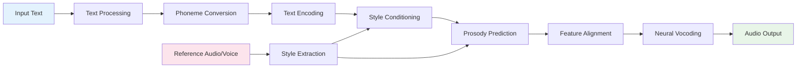

# Kokoro vs StyleTTS2: Detailed Comparison

## Shared Workflow Overview

Both Kokoro and StyleTTS2 follow a similar high-level TTS workflow, representing the standard neural text-to-speech pipeline:

### Common Pipeline Steps



### 1. Text Processing and Phonemization
- **Input**: Raw text in various languages
- **Process**: Convert text to phoneme sequences
- **Output**: Tokenized phonemes ready for neural processing

### 2. Text Encoding
- **Input**: Phoneme sequences
- **Process**: Neural encoding through embedding → CNN → LSTM architecture
- **Output**: Contextual text representations

### 3. Style Conditioning
- **Input**: Reference audio or voice embeddings
- **Process**: Extract and apply speaker/style characteristics
- **Output**: Style-conditioned features

### 4. Prosody Prediction
- **Input**: Style-conditioned text features
- **Process**: Predict duration, F0 (pitch), and energy contours
- **Output**: Prosodic parameters for natural speech timing

### 5. Feature Alignment
- **Input**: Text features and predicted durations
- **Process**: Align text features to acoustic timeline
- **Output**: Time-aligned acoustic features

### 6. Neural Vocoding
- **Input**: Aligned features and prosodic parameters
- **Process**: Generate waveform using neural vocoder
- **Output**: High-quality audio waveform

## Shared Components Analysis

### ISTFT-Net Vocoder Architecture

Both models share nearly identical ISTFT-Net implementations, indicating a common foundation:

#### Core Shared Classes

| Component | Kokoro Location | StyleTTS2 Location | Purpose |
|-----------|----------------|-------------------|---------|
| [`AdaIN1d`](kokoro/istftnet.py:20) | `kokoro/istftnet.py:20` | `styletts2/Modules/istftnet.py:15` | Adaptive Instance Normalization for style conditioning |
| [`AdaINResBlock1`](kokoro/istftnet.py:34) | `kokoro/istftnet.py:34` | `styletts2/Modules/istftnet.py:27` | Style-conditioned residual blocks |
| [`SineGen`](kokoro/istftnet.py:108) | `kokoro/istftnet.py:108` | `styletts2/Modules/istftnet.py:111` | Harmonic sine wave generation |
| [`SourceModuleHnNSF`](kokoro/istftnet.py:212) | `kokoro/istftnet.py:212` | `styletts2/Modules/istftnet.py:250` | Harmonic + noise source modeling |
| [`TorchSTFT`](kokoro/istftnet.py:80) | `kokoro/istftnet.py:80` | `styletts2/Modules/istftnet.py:83` | STFT/ISTFT operations |
| [`Generator`](kokoro/istftnet.py:257) | `kokoro/istftnet.py:257` | `styletts2/Modules/istftnet.py:302` | Main vocoder generator |

#### Shared Vocoder Features
- **Harmonic Modeling**: Both use [`SourceModuleHnNSF`](kokoro/istftnet.py:212) for periodic excitation
- **Noise Modeling**: Aperiodic excitation for unvoiced sounds
- **Style Conditioning**: [`AdaIN1d`](kokoro/istftnet.py:20) normalization throughout
- **STFT Processing**: Spectral domain synthesis with inverse STFT

### Text Encoding Architecture

Both models implement similar text encoding patterns:

#### Shared Text Processing Components

| Component | Kokoro | StyleTTS2 | Shared Features |
|-----------|--------|-----------|----------------|
| [`TextEncoder`](kokoro/modules.py:35) | `kokoro/modules.py:35` | `styletts2/models.py:284` | Embedding → CNN → LSTM architecture |
| [`LayerNorm`](kokoro/modules.py:21) | `kokoro/modules.py:21` | `styletts2/models.py:270` | Layer normalization |
| [`LinearNorm`](kokoro/modules.py:11) | `kokoro/modules.py:11` | `styletts2/models.py:166` | Xavier-initialized linear layers |

#### Common Text Encoding Flow
```python
# Shared pattern in both models
x = self.embedding(phonemes)           # Phoneme embeddings
x = x.transpose(1, 2)                  # [B, T, emb] → [B, emb, T]
for cnn_layer in self.cnn:             # CNN processing
    x = cnn_layer(x)
x = x.transpose(1, 2)                  # [B, emb, T] → [B, T, emb]
x, _ = self.lstm(x)                    # Bidirectional LSTM
```

### Prosody Prediction Architecture

Both implement sophisticated prosody prediction with similar components:

#### Shared Prosody Components

| Component | Purpose | Kokoro | StyleTTS2 |
|-----------|---------|--------|-----------|
| [`ProsodyPredictor`](kokoro/modules.py:91) | Main prosody prediction | `kokoro/modules.py:91` | `styletts2/models.py:440` |
| [`DurationEncoder`](kokoro/modules.py:137) | Duration modeling | `kokoro/modules.py:137` | `styletts2/models.py:517` |
| [`AdaLayerNorm`](kokoro/modules.py:72) | Style-conditioned normalization | `kokoro/modules.py:72` | `styletts2/models.py:418` |
| [`AdainResBlk1d`](kokoro/istftnet.py:340) | 1D residual blocks with style | `kokoro/istftnet.py:340` | `styletts2/models.py:372` |

#### Common Prosody Prediction Flow
```python
# Shared prosody prediction pattern
d = self.text_encoder(texts, style, text_lengths, mask)    # Style-conditioned encoding
x, _ = self.lstm(d)                                        # LSTM processing
duration = self.duration_proj(x)                          # Duration prediction
F0_pred, N_pred = self.F0Ntrain(aligned_features, style)  # F0 and energy prediction
```

## Key Architectural Differences

### 1. Model Complexity and Scale

| Aspect | Kokoro | StyleTTS2 |
|--------|--------|-----------|
| **Parameters** | 82 million | 200+ million |
| **Model Size** | ~330MB | ~800MB+ |
| **Architecture** | Streamlined, efficient | Complex, research-grade |
| **Components** | Essential components only | Multiple specialized modules |

### 2. Training Methodology

#### Kokoro: Direct Optimization
```python
# Simple, direct training approach
loss = reconstruction_loss + prosody_loss + style_loss
optimizer.step()
```

#### StyleTTS2: Adversarial + Diffusion Training
```python
# Complex multi-component training
nets = Munch(
    generator=generator,
    mpd=MultiPeriodDiscriminator(),
    msd=MultiResSpecDiscriminator(), 
    wd=WavLMDiscriminator(),
    diffusion=AudioDiffusionConditional()
)

# Adversarial training loop
gen_loss = generator_loss + adversarial_loss + diffusion_loss
disc_loss = discriminator_loss
```

### 3. Style Modeling Approaches

#### Kokoro: Reference Audio Embeddings
- **Method**: Direct use of pre-computed voice embeddings
- **Storage**: Voice vectors cached as `.pt` files
- **Usage**: `ref_s[:, :128]` for decoder, `ref_s[:, 128:]` for prosody
- **Advantage**: Simple, efficient, fast inference

#### StyleTTS2: Learned Style Encoders
- **Method**: Neural networks extract style from reference audio
- **Architecture**: [`StyleEncoder`](styletts2/models.py:139) with 2D convolutions
- **Dual Encoders**: Separate acoustic and prosodic style extraction
- **Advantage**: More flexible, learnable style representations

### 4. Language Support Strategy

#### Kokoro: Multilingual Focus
```python
LANG_CODES = {
    'a': 'American English', 'b': 'British English',
    'e': 'Spanish', 'f': 'French', 'h': 'Hindi',
    'i': 'Italian', 'j': 'Japanese', 'p': 'Portuguese', 'z': 'Chinese'
}

# Language-specific G2P processing
if lang_code in 'ab':
    self.g2p = en.G2P(trf=trf, british=lang_code=='b')
elif lang_code == 'j':
    self.g2p = ja.JAG2P()
elif lang_code == 'z':
    self.g2p = zh.ZHG2P()
```

#### StyleTTS2: English-Centric
- **Focus**: Primarily English language support
- **Architecture**: Optimized for English phonetics and prosody
- **Extensibility**: Would require significant modifications for other languages

### 5. Vocoder Options and Flexibility

#### Kokoro: ISTFT-Net Only
- **Single Vocoder**: ISTFT-Net implementation
- **Optimization**: Custom STFT for ONNX compatibility
- **Focus**: Deployment efficiency

#### StyleTTS2: Dual Vocoder Support
```python
# Flexible vocoder selection
if args.decoder.type == "istftnet":
    from Modules.istftnet import Decoder
elif args.decoder.type == "hifigan":
    from Modules.hifigan import Decoder
```
- **Options**: ISTFT-Net and HiFi-GAN
- **Trade-offs**: Quality vs. speed selection
- **Research**: Comparative vocoder studies

### 6. Advanced Features and Enhancements

#### Kokoro: Production-Ready Features
- **ONNX Export**: Custom STFT implementation for deployment
- **Streaming**: Low-latency inference capabilities
- **Memory Efficiency**: Optimized for resource-constrained environments
- **CLI Interface**: Ready-to-use command-line tool

#### StyleTTS2: Research-Grade Enhancements
- **Diffusion Models**: [`AudioDiffusionConditional`](styletts2/Modules/diffusion/diffusion.py:66) for quality enhancement
- **Multiple Discriminators**: Comprehensive adversarial training
- **Style Transfer**: Advanced voice cloning capabilities
- **Experimental Features**: Cutting-edge research implementations

## Performance and Quality Trade-offs

### Kokoro: Efficiency-Focused
**Strengths:**
- Fast inference (real-time on CPU)
- Low memory footprint
- Multi-language support
- Production deployment ready
- ONNX compatibility

**Trade-offs:**
- Simpler style control
- Limited to reference audio embeddings
- No adversarial training benefits

### StyleTTS2: Quality-Focused
**Strengths:**
- State-of-the-art audio quality
- Advanced style control and voice cloning
- Cutting-edge research techniques
- Flexible architecture for experimentation

**Trade-offs:**
- Higher computational requirements
- Complex training process
- Primarily English-focused
- Challenging deployment

## Use Case Recommendations

### Choose Kokoro When:
- **Production Deployment**: Need efficient, reliable TTS in production
- **Multilingual Support**: Require support for multiple languages
- **Resource Constraints**: Limited computational resources
- **Fast Inference**: Real-time or low-latency requirements
- **Simple Integration**: Want straightforward API and usage

### Choose StyleTTS2 When:
- **Maximum Quality**: Audio quality is the top priority
- **Research Applications**: Exploring advanced TTS techniques
- **Style Control**: Need sophisticated voice cloning and style transfer
- **Experimental Work**: Want to experiment with diffusion and adversarial training
- **English Focus**: Primarily working with English language content

## Technical Implementation Insights

### Shared Foundation Benefits
The shared ISTFT-Net components indicate both models benefit from:
- **Proven Architecture**: Well-tested vocoder design
- **High-Quality Output**: Spectral domain synthesis advantages
- **Style Conditioning**: Effective AdaIN-based style application

### Divergent Optimization Strategies
- **Kokoro**: Optimizes for deployment efficiency and multilingual support
- **StyleTTS2**: Optimizes for maximum quality and research flexibility

### Architecture Evolution
The comparison reveals how the same foundational components can be:
- **Streamlined** (Kokoro): For practical deployment
- **Enhanced** (StyleTTS2): For research and quality maximization

## Conclusion

Both Kokoro and StyleTTS2 demonstrate excellent engineering approaches to neural TTS, sharing fundamental components while optimizing for different objectives. The shared ISTFT-Net foundation provides both models with high-quality vocoding capabilities, while their divergent architectures reflect different priorities in the TTS landscape: production efficiency versus research-grade quality.

The comparison highlights how the same core TTS principles can be implemented with different complexity levels and optimization targets, making both models valuable for their respective use cases in the broader TTS ecosystem.