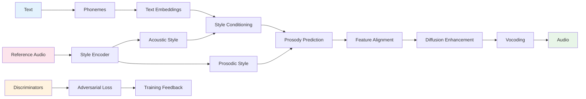

# StyleTTS2 Model: Architecture and Workflow Analysis

## Overview

StyleTTS2 is a sophisticated neural text-to-speech (TTS) system that focuses on high-quality, expressive speech synthesis with advanced style control. The system combines adversarial training, diffusion models, and multiple discriminators to achieve state-of-the-art audio quality with fine-grained style manipulation capabilities.

## Model Architecture

### Core Components

The StyleTTS2 model consists of several interconnected components working together:

#### 1. Main Model ([`models.py`](styletts2/models.py))
The central neural network architecture that orchestrates:
- **Text Encoding**: Converts phonemes to contextual embeddings
- **Style Modeling**: Extracts and applies speaker/prosodic styles
- **Prosody Prediction**: Predicts duration, F0 (pitch), and energy
- **Audio Generation**: Synthesizes high-quality waveforms

**Key Submodules:**
- [`TextEncoder`](styletts2/models.py:284): Processes phoneme sequences with CNN+LSTM
- [`StyleEncoder`](styletts2/models.py:139): Extracts acoustic and prosodic styles from reference audio
- [`ProsodyPredictor`](styletts2/models.py:440): Predicts speech timing and prosodic features
- [`Decoder`](styletts2/Modules/istftnet.py:467): Generates audio waveform with style conditioning

#### 2. Discriminator Networks ([`discriminators.py`](styletts2/Modules/discriminators.py))
Multiple discriminators for adversarial training:
- [`MultiPeriodDiscriminator`](styletts2/Modules/discriminators.py:132): Analyzes audio at different periods
- [`MultiResSpecDiscriminator`](styletts2/Modules/discriminators.py:65): Multi-resolution spectral analysis
- [`WavLMDiscriminator`](styletts2/Modules/discriminators.py:158): Uses WavLM features for semantic discrimination

#### 3. Diffusion Model ([`diffusion/diffusion.py`](styletts2/Modules/diffusion/diffusion.py))
Advanced diffusion-based enhancement:
- [`AudioDiffusionConditional`](styletts2/Modules/diffusion/diffusion.py:66): Conditional audio diffusion
- [`StyleTransformer1d`](styletts2/Modules/diffusion/modules.py): Style-aware transformer for diffusion
- [`KDiffusion`](styletts2/Modules/diffusion/sampler.py): Diffusion sampling with various schedulers

#### 4. Neural Vocoders
Dual vocoder support:
- **ISTFT-Net** ([`istftnet.py`](styletts2/Modules/istftnet.py)): STFT-based high-quality vocoder
- **HiFi-GAN** ([`hifigan.py`](styletts2/Modules/hifigan.py)): GAN-based vocoder alternative

## Detailed Workflow

### Data Flow Summary



### 1. Text Processing and Style Extraction

```
Input Text → Phonemes → Text Encoding
Reference Audio → Style Extraction → Style Vectors
```

**Process:**
1. **Text Encoding**: Uses [`TextEncoder`](styletts2/models.py:284) with embedding → CNN → LSTM architecture
2. **Style Extraction**: [`StyleEncoder`](styletts2/models.py:139) processes reference audio through 2D convolutions
3. **Dual Style Vectors**: Separate encoders for acoustic and prosodic styles

**Code Flow:**
```python
# Text processing
text_embeddings = text_encoder(phonemes, input_lengths, text_mask)

# Style extraction
acoustic_style = style_encoder(reference_mel)
prosodic_style = predictor_encoder(reference_mel)
```

### 2. Advanced Prosody Prediction

**Prosody Modeling Process**:
```python
# In ProsodyPredictor.forward()
d = self.text_encoder(texts, style, text_lengths, m)  # Style-conditioned text features

# Duration prediction with LSTM
input_lengths = text_lengths.cpu().numpy()
x = nn.utils.rnn.pack_padded_sequence(d, input_lengths, batch_first=True, enforce_sorted=False)
self.lstm.flatten_parameters()
x, _ = self.lstm(x)
x, _ = nn.utils.rnn.pad_packed_sequence(x, batch_first=True)
duration = self.duration_proj(nn.functional.dropout(x, 0.5, training=self.training))

# F0 and Energy prediction with style conditioning
en = (d.transpose(-1, -2) @ alignment)
F0_pred, N_pred = self.F0Ntrain(en, style)
```

**Advanced Features**:
- **Style-Conditioned Duration**: Uses [`DurationEncoder`](styletts2/models.py:517) with adaptive layer normalization
- **Hierarchical F0 Modeling**: Multi-scale F0 prediction with [`AdainResBlk1d`](styletts2/models.py:372)
- **Energy Modeling**: Separate energy prediction branch

### 3. Diffusion-Enhanced Generation

```
Style-Conditioned Features → Diffusion Model → Enhanced Features → Vocoding → Audio
```

**Location**: [`AudioDiffusionConditional`](styletts2/Modules/diffusion/diffusion.py:66)

#### Step 3.1: Diffusion Process
```python
# Diffusion forward process
diffusion = AudioDiffusionConditional(
    in_channels=1,
    embedding_max_length=bert.config.max_position_embeddings,
    embedding_features=bert.config.hidden_size,
    embedding_mask_proba=args.diffusion.embedding_mask_proba,
    channels=style_dim*2,
    context_features=style_dim*2,
)

# Enhanced feature generation
enhanced_features = diffusion.sample(
    noise,
    embedding=text_embeddings,
    context=style_features
)
```

#### Step 3.2: Multi-Vocoder Support
```python
# Vocoder selection
if args.decoder.type == "istftnet":
    from Modules.istftnet import Decoder
    decoder = Decoder(dim_in=args.hidden_dim, style_dim=args.style_dim, dim_out=args.n_mels,
            resblock_kernel_sizes = args.decoder.resblock_kernel_sizes,
            upsample_rates = args.decoder.upsample_rates,
            upsample_initial_channel=args.decoder.upsample_initial_channel,
            resblock_dilation_sizes=args.decoder.resblock_dilation_sizes,
            upsample_kernel_sizes=args.decoder.upsample_kernel_sizes,
            gen_istft_n_fft=args.decoder.gen_istft_n_fft, gen_istft_hop_size=args.decoder.gen_istft_hop_size)
else:
    from Modules.hifigan import Decoder
    decoder = Decoder(dim_in=args.hidden_dim, style_dim=args.style_dim, dim_out=args.n_mels,
            resblock_kernel_sizes = args.decoder.resblock_kernel_sizes,
            upsample_rates = args.decoder.upsample_rates,
            upsample_initial_channel=args.decoder.upsample_initial_channel,
            resblock_dilation_sizes=args.decoder.resblock_dilation_sizes,
            upsample_kernel_sizes=args.decoder.upsample_kernel_sizes)
```

### 4. Adversarial Training Pipeline

**Multi-Discriminator Architecture**:
```python
# Multiple discriminators for comprehensive evaluation
nets = Munch(
    mpd = MultiPeriodDiscriminator(),      # Temporal patterns
    msd = MultiResSpecDiscriminator(),     # Spectral patterns  
    wd = WavLMDiscriminator(),             # Semantic patterns
)
```

**Training Process**:
1. **Generator Loss**: Combines reconstruction, adversarial, and perceptual losses
2. **Discriminator Loss**: Real vs. fake audio classification
3. **Feature Matching**: Intermediate feature alignment
4. **Style Loss**: Style consistency across different inputs

## Technical Architecture Details

### Model Components Breakdown

#### StyleEncoder ([`models.py:139`](styletts2/models.py:139))
- **Purpose**: Extract acoustic style from reference audio
- **Architecture**: 2D CNN with spectral normalization
- **Input**: Mel-spectrogram
- **Output**: Style embedding vector

```python
class StyleEncoder(nn.Module):
    def __init__(self, dim_in=48, style_dim=48, max_conv_dim=384):
        # 4 residual blocks with progressive downsampling
        for _ in range(4):
            blocks += [ResBlk(dim_in, dim_out, downsample='half')]
        # Global average pooling + linear projection
        blocks += [nn.AdaptiveAvgPool2d(1)]
        self.unshared = nn.Linear(dim_out, style_dim)
```

#### ProsodyPredictor ([`models.py:440`](styletts2/models.py:440))
- **Duration Encoder**: Multi-layer LSTM with adaptive normalization
- **F0 Predictor**: Style-conditioned pitch contour generation  
- **Energy Predictor**: Loudness/energy modeling with upsampling
- **Style Integration**: AdaIN-based style conditioning throughout

#### Diffusion Integration ([`diffusion/diffusion.py`](styletts2/Modules/diffusion/diffusion.py))
- **Conditional Generation**: Text and style-conditioned diffusion
- **Transformer Backbone**: [`StyleTransformer1d`](styletts2/Modules/diffusion/modules.py) for sequence modeling
- **Flexible Sampling**: Multiple sampling strategies and schedulers

### Key Innovations

#### 1. Multi-Scale Style Modeling
```python
# Separate style encoders for different aspects
style_encoder = StyleEncoder(...)      # Acoustic characteristics
predictor_encoder = StyleEncoder(...)  # Prosodic patterns

# Style application at multiple levels
acoustic_style = style_encoder(reference_audio)
prosodic_style = predictor_encoder(reference_audio)
```

#### 2. Adversarial Training with Multiple Discriminators
```python
class MultiResSpecDiscriminator(nn.Module):
    def __init__(self, fft_sizes=[1024, 2048, 512], hop_sizes=[120, 240, 50], win_lengths=[600, 1200, 240]):
        self.discriminators = nn.ModuleList([
            SpecDiscriminator(fft_sizes[0], hop_sizes[0], win_lengths[0], window="hann_window"),
            SpecDiscriminator(fft_sizes[1], hop_sizes[1], win_lengths[1], window="hann_window"),
            SpecDiscriminator(fft_sizes[2], hop_sizes[2], win_lengths[2], window="hann_window")
        ])
```

#### 3. Diffusion-Based Enhancement
```python
# Conditional diffusion for quality enhancement
diffusion.diffusion = KDiffusion(
    net=transformer,
    sigma_distribution=LogNormalDistribution(mean=args.mean, std=args.std),
    dynamic_threshold=0.0
)
```

#### 4. Flexible Vocoder Architecture
- **ISTFT-Net**: Spectral-domain synthesis with harmonic modeling
- **HiFi-GAN**: Time-domain synthesis with adversarial training
- **Runtime Selection**: Choose vocoder based on quality/speed requirements

## Advanced Features

### 1. Style Transfer and Voice Cloning
```python
# Extract style from reference speaker
reference_style = style_encoder(reference_mel)

# Apply to different text
synthesized_audio = model(
    text=new_text,
    style=reference_style
)
```

### 2. Multi-Speaker Training
```python
# Multi-speaker transformer for diffusion
if args.multispeaker:
    transformer = StyleTransformer1d(
        channels=args.style_dim*2,
        context_embedding_features=bert.config.hidden_size,
        context_features=args.style_dim*2
    )
```

### 3. Training-Time Augmentation
```python
# Random prosody augmentation during training
if self.training:
    downlist = [0, 3, 7]
    F0_down = downlist[random.randint(0, 2)]
    downlist = [0, 3, 7, 15]
    N_down = downlist[random.randint(0, 3)]
    if F0_down:
        F0_curve = nn.functional.conv1d(F0_curve.unsqueeze(1),
                           torch.ones(1, 1, F0_down).to('cuda'),
                           padding=F0_down//2).squeeze(1) / F0_down
    if N_down:
        N = nn.functional.conv1d(N.unsqueeze(1), torch.ones(1, 1, N_down).to('cuda'), padding=N_down//2).squeeze(1) / N_down
```

## Usage Patterns

### Basic Usage
```python
# Load pre-trained model
nets = build_model(args, text_aligner, pitch_extractor, bert)
nets, optimizer, epoch, iters = load_checkpoint(
    nets, optimizer, checkpoint_path
)

# Synthesize speech
with torch.no_grad():
    # StyleTTS2 doesn't have a single synthesize method
    # Instead it uses the forward pass of individual components
    text_embeddings = nets.text_encoder(phonemes, input_lengths, text_mask)
    style = nets.style_encoder(reference_mel)
    audio = nets.decoder(text_embeddings, F0_curve, N, style)
```

### Advanced Style Control
```python
# Fine-grained style control
acoustic_style = style_encoder(reference_audio)
prosodic_style = predictor_encoder(reference_audio)

# Mix styles from different speakers
mixed_style = 0.7 * style_a + 0.3 * style_b

# Generate with custom style
audio = model.forward(
    text=phonemes,
    acoustic_style=mixed_style,
    prosodic_style=prosodic_style
)
```

### Training Configuration
```python
# Multi-component training
nets = build_model(args, text_aligner, pitch_extractor, bert)

# Adversarial training loop
for batch in dataloader:
    # Generator step
    gen_loss = compute_generator_loss(nets, batch)
    
    # Discriminator step  
    disc_loss = compute_discriminator_loss(nets, batch)
    
    # Update networks
    optimizer_g.step()
    optimizer_d.step()
```

## Performance Characteristics

### Model Complexity
- **Parameters**: 200M+ (varies by configuration)
- **Model Size**: ~800MB+ (full model with discriminators)
- **Training Time**: Requires substantial GPU resources
- **Inference Speed**: Slower than simpler models due to diffusion

### Quality Metrics
- **Sample Rate**: 24kHz (configurable)
- **Quality**: State-of-the-art naturalness and expressiveness
- **Style Fidelity**: Excellent voice cloning capabilities
- **Robustness**: Handles diverse speaking styles and emotions

### Training Requirements
- **GPU Memory**: 16GB+ recommended
- **Training Data**: Large-scale multi-speaker datasets
- **Training Time**: Days to weeks depending on dataset size
- **Convergence**: Requires careful hyperparameter tuning

## Deployment Considerations

### Dependencies
- **Core**: PyTorch, transformers, einops
- **Audio Processing**: librosa, scipy
- **Training**: Specialized discriminator and diffusion components
- **Utilities**: munch, yaml, tqdm

### Production Deployment
```python
# Optimized inference setup
nets.eval()
for key in nets:
    nets[key].eval()

# Remove weight normalization for faster inference
for key in nets:
    if hasattr(nets[key], 'remove_weight_norm'):
        nets[key].remove_weight_norm()

# Inference with reduced precision
with torch.cuda.amp.autocast():
    # Use individual component forward passes
    text_embeddings = nets.text_encoder(text, input_lengths, text_mask)
    style = nets.style_encoder(reference_audio)
    audio = nets.decoder(text_embeddings, F0_curve, N, style)
```

### Memory Optimization
```python
# Mixed precision training
scaler = torch.cuda.amp.GradScaler()
with torch.cuda.amp.autocast():
    loss = compute_loss(nets, batch)
    
# Note: StyleTTS2 doesn't use gradient_checkpointing_enable()
# Memory optimization is handled through other means
```

## Comparison with Other TTS Systems

### Advantages
- **Quality**: State-of-the-art audio quality through adversarial training
- **Expressiveness**: Superior style control and voice cloning
- **Flexibility**: Multiple vocoder options and training strategies
- **Research-Oriented**: Cutting-edge techniques and extensive configurability

### Trade-offs
- **Complexity**: More complex architecture and training process
- **Resources**: Higher computational and memory requirements
- **Deployment**: More challenging to deploy in resource-constrained environments
- **Training**: Requires expertise in adversarial training and diffusion models

## Conclusion

StyleTTS2 represents a state-of-the-art approach to neural text-to-speech synthesis, prioritizing maximum quality and expressiveness through sophisticated architectural choices. The system's combination of adversarial training, diffusion models, and multi-scale style modeling creates a powerful framework for high-quality speech synthesis with exceptional style control capabilities.

The architecture's emphasis on research-grade quality makes it particularly suitable for applications requiring the highest audio fidelity and most natural-sounding speech, though at the cost of increased computational complexity and deployment challenges. The modular design allows researchers and practitioners to experiment with different components and training strategies while maintaining a solid foundation for advanced TTS research.

The integration of multiple discriminators, diffusion-based enhancement, and flexible vocoder architectures positions StyleTTS2 as a comprehensive platform for exploring the frontiers of neural speech synthesis, making it an excellent choice for research applications and high-end commercial deployments where quality is paramount.