# Dia TTS Pipeline with Reference Audio - Flowchart

## Complete Flow Diagram

```mermaid
flowchart TD
    %% Input Stage
    A[Text Input: Hello world] --> B[Reference Audio File: voice.wav]
    
    %% Text Processing
    A --> C[Text Encoding]
    C --> C1[Byte-level encoding: UTF-8]
    C1 --> C2[Replace special tokens: S1→x01, S2→x02]
    C2 --> C3[Convert to tensor: torch.tensor]
    C3 --> C4[Pad to max length: 1024 tokens]
    
    %% Reference Audio Processing
    B --> D[Audio Loading and Processing]
    D --> D1[Load audio: torchaudio.load]
    D1 --> D2[Resample to 44.1kHz if needed]
    D2 --> D3[Convert to mono if stereo]
    D3 --> D4[DAC Preprocessing: normalize]
    D4 --> D5[DAC Encoding: audio to 9-channel codes]
    D5 --> D6[Transpose: TxC format]
    
    %% Encoder Stage
    C4 --> E[Text Encoder]
    E --> E1[Create CFG inputs: uncond, cond]
    E1 --> E2[Text Embedding: vocab_size=256]
    E2 --> E3[12 Encoder Layers]
    E3 --> E31[Self-Attention + RoPE]
    E31 --> E32[Feed-Forward Network]
    E32 --> E33[Residual Connections]
    E33 --> E4[Final RMSNorm]
    E4 --> E5[Encoder Output: 2BxTx1024]
    
    %% Audio Prompt Preparation
    D6 --> F[Audio Prompt Processing]
    F --> F1[Add BOS token at position 0]
    F1 --> F2[Apply delay pattern: 0,8,9,10,11,12,13,14,15]
    F2 --> F21[Channel 0: no delay]
    F2 --> F22[Channel 1: delay by 8 steps]
    F2 --> F23[Channel 2-8: delay by 9-15 steps]
    F21 --> F3[Delayed Audio Prompt: BxTx9]
    F22 --> F3
    F23 --> F3
    
    %% Decoder Initialization
    E5 --> G[Decoder Initialization]
    F3 --> G
    G --> G1[Create Decoder State]
    G1 --> G2[Initialize KV Caches: 18 layers]
    G2 --> G3[Precompute Cross-Attention KV from encoder]
    G3 --> G4[Create Causal Attention Masks]
    G4 --> G5[Prefill with audio prompt]
    G5 --> G6[Set prefill steps per batch item]
    
    %% Generation Loop
    G6 --> H[Autoregressive Generation Loop]
    H --> H1[Get current tokens at step t]
    H1 --> H2[Repeat for CFG: 2Bx1x9]
    H2 --> H3[Multi-channel embedding sum]
    H3 --> H4[18 Decoder Layers]
    
    %% Decoder Layer Detail
    H4 --> H41[Self-Attention with KV Cache]
    H41 --> H42[Cross-Attention to Encoder]
    H42 --> H43[Feed-Forward Network]
    H43 --> H44[Update KV Caches]
    H44 --> H5[Output Logits: 2Bx1x9x1028]
    
    %% CFG and Sampling
    H5 --> I[Classifier-Free Guidance]
    I --> I1[Split: uncond_logits, cond_logits]
    I1 --> I2[CFG: cond + scale x cond - uncond]
    I2 --> I3[Apply constraints: mask invalid tokens]
    I3 --> I4[Top-k filtering: keep top 45 tokens]
    I4 --> I5[Temperature scaling: logits/1.2]
    I5 --> I6[Top-p sampling: nucleus sampling]
    I6 --> I7[Sample next tokens: multinomial]
    
    %% EOS Handling
    I7 --> J[EOS Detection and Padding]
    J --> J1[Check if EOS token sampled in channel 0]
    J1 --> J2[Start countdown: max_delay_pattern steps]
    J2 --> J3[Apply channel-specific EOS/PAD tokens]
    J3 --> J4[Update generation state]
    
    %% Loop Control
    J4 --> K{Continue Generation?}
    K -->|Yes, not max tokens| H1
    K -->|No, EOS or max reached| L[Post-Processing]
    
    %% Output Processing
    L --> L1[Extract generated sequences]
    L1 --> L2[Remove padding and special tokens]
    L2 --> L3[Revert delay pattern]
    L3 --> L31[Channel 0: no adjustment]
    L3 --> L32[Channel 1: advance by 8 steps]
    L3 --> L33[Channels 2-8: advance by 9-15 steps]
    L31 --> L4[Reverted Audio Codes: BxTx9]
    L32 --> L4
    L33 --> L4
    
    %% DAC Decoding
    L4 --> M[DAC Decoding]
    M --> M1[Clamp codes to valid range: 0 to 1023]
    M1 --> M2[Reshape for DAC: Bx9xT]
    M2 --> M3[DAC Quantizer: codes to audio values]
    M3 --> M4[DAC Decoder: audio values to waveform]
    M4 --> M5[Final Audio: 44.1kHz waveform]
    
    %% Output
    M5 --> N[Generated Speech Audio]
    
    %% Styling
    classDef inputNode fill:#e1f5fe
    classDef processNode fill:#f3e5f5
    classDef encoderNode fill:#e8f5e8
    classDef decoderNode fill:#fff3e0
    classDef outputNode fill:#ffebee
    
    class A,B inputNode
    class C,C1,C2,C3,C4,D,D1,D2,D3,D4,D5,D6,F,F1,F2,F21,F22,F23,F3 processNode
    class E,E1,E2,E3,E31,E32,E33,E4,E5 encoderNode
    class G,G1,G2,G3,G4,G5,G6,H,H1,H2,H3,H4,H41,H42,H43,H44,H5,I,I1,I2,I3,I4,I5,I6,I7,J,J1,J2,J3,J4,K,L,L1,L2,L3,L31,L32,L33,L4,M,M1,M2,M3,M4,M5 decoderNode
    class N outputNode
```



## Key Components Breakdown

### 1. Reference Audio Processing Pipeline
```
Audio File → Load → Resample → Mono → DAC Preprocess → DAC Encode → Format
voice.wav   44.1kHz  (if needed)  (if stereo)  (normalize)    (9 channels)  (TxC)
```

### 2. Delay Pattern Application
The delay pattern `0, 8, 9, 10, 11, 12, 13, 14, 15` is crucial for audio quality:

```
Original:  BOS, A1, A2, A3, A4, A5, ...
Channel 0: BOS, A1, A2, A3, A4, A5, ...  (No delay)
Channel 1: BOS, PAD, PAD, PAD, PAD, PAD, PAD, PAD, PAD, A1, A2, A3, ...  (Delay 8)
Channel 2: BOS, PAD, PAD, PAD, PAD, PAD, PAD, PAD, PAD, PAD, A1, A2, ...  (Delay 9)
...
```

### 3. Classifier-Free Guidance (CFG) Flow
```
Text Input → Empty Text, Original Text → Encoder → Uncond Output, Cond Output
                                                   ↓
Final Logits = Cond + CFG_Scale x (Cond - Uncond)
```

### 4. Generation Loop with Reference Audio
```
Step 0: Use reference audio tokens (prefill)
Step 1: Generate based on reference + text conditioning
Step 2: Generate based on previous tokens + text conditioning
...
Step N: Continue until EOS or max tokens
```

### 5. EOS Handling with Delays
When EOS is detected in channel 0:
1. Start countdown = max_delay_pattern (15 steps)
2. For each remaining step:
   - If step_after_eos == channel_delay: place EOS in that channel
   - If step_after_eos > channel_delay: place PAD in that channel
   - Otherwise: continue normal generation

### 6. Audio Reconstruction
```
Generated Delayed Codes → Revert Delays → Clamp to 0,1023 → DAC Decode → Audio
      (BxTx9)                (BxTx9)         (BxTx9)         (Bx44.1kHz)
```

## Critical Implementation Details

### Memory Management
- **KV Caches**: Stored for 18 decoder layers × 2 (self + cross attention)
- **Batch Size**: Doubled for CFG (unconditional + conditional)
- **Sequence Length**: Up to 3072 tokens (configurable)

### Audio Prompt Integration
- Reference audio provides **initial conditioning** for voice characteristics
- Model learns to **continue in the same voice** while following text
- Delay pattern ensures **smooth transitions** between reference and generated audio

### Quality Control
- **CFG Scale**: Higher values (3.0) increase text adherence
- **Temperature**: Controls randomness (1.2 for natural speech)
- **Top-p/Top-k**: Prevents low-quality token selection
- **EOS Constraints**: Ensures proper sequence termination

This pipeline enables high-quality voice cloning by conditioning the generation process on reference audio while maintaining strong text-to-speech alignment through the sophisticated encoder-decoder architecture.