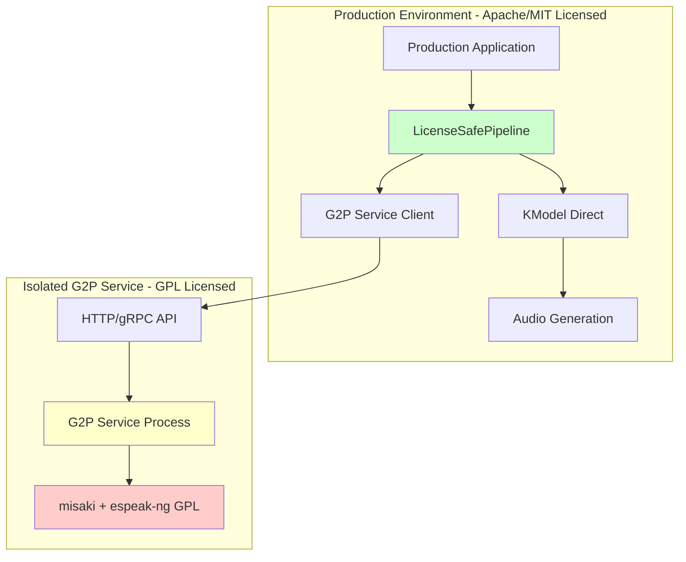

# License Compliance Architecture for Kokoro TTS

## Problem Statement

The current [`KPipeline`](kokoro/pipeline.py:42) class has a hard dependency on the `misaki` library, which uses `espeak-ng` (GPL 3.0 licensed). This creates licensing issues for production use in commercial applications due to GPL's copyleft requirements.

## Current Architecture Analysis

### GPL Dependencies
- **misaki library**: Uses espeak-ng for G2P conversion
- **espeak-ng**: GPL 3.0 licensed - requires derivative works to be GPL
- **Location**: Lines 5, 118, 123, 144 in [`kokoro/pipeline.py`](kokoro/pipeline.py:5)

### License-Clean Components
- **KModel**: Pure PyTorch model, no GPL dependencies
- **Voice loading**: HuggingFace Hub downloads, Apache licensed
- **Audio generation**: Uses phonemes directly, no text processing

## Proposed Solution Architecture



## Implementation Plan

### 1. G2P Service (GPL Isolated)

**File**: `g2p_service/server.py`
```python
# Standalone HTTP service that wraps misaki G2P functionality
# Runs in separate process/container to isolate GPL code
# Provides REST API: POST /g2p {"text": "hello", "lang": "en"} -> {"phonemes": "həˈloʊ"}
```

**File**: `g2p_service/requirements.txt`
```
misaki[en]
flask
gunicorn
```

**File**: `g2p_service/Dockerfile`
```dockerfile
# Containerized G2P service for complete isolation
FROM python:3.11-slim
# Install GPL dependencies in isolation
```

### 2. License-Safe Pipeline

**File**: `kokoro/safe_pipeline.py`
```python
class LicenseSafePipeline:
    """
    Production-safe pipeline that avoids GPL dependencies.
    Uses external G2P service or pre-converted phonemes.
    """
    
    def __init__(self, g2p_service_url: Optional[str] = None):
        # Initialize without GPL dependencies
        # Optional G2P service client for text->phonemes
        
    def from_phonemes(self, phonemes: str, voice: str) -> torch.Tensor:
        # Direct phoneme input - no GPL dependencies
        
    def from_text(self, text: str, voice: str) -> torch.Tensor:
        # Uses G2P service if available, otherwise raises error
```

### 3. G2P Service Client

**File**: `kokoro/g2p_client.py`
```python
class G2PClient:
    """HTTP client for G2P service communication"""
    
    def convert(self, text: str, lang: str) -> str:
        # Makes HTTP request to G2P service
        # Returns phonemes string
```

### 4. Updated Demo

**File**: `kokoro_test/safe_demo.py`
```python
# Demonstrates license-safe usage patterns:
# 1. Direct phoneme input (no GPL)
# 2. External G2P service (GPL isolated)
# 3. Pre-converted phoneme files
```

## Usage Patterns

### Pattern 1: Direct Phoneme Input (Recommended)
```python
from kokoro.safe_pipeline import LicenseSafePipeline

pipeline = LicenseSafePipeline()
# Pre-converted phonemes (no GPL dependencies)
phonemes = "həˈloʊ wɜrld"
audio = pipeline.from_phonemes(phonemes, voice="af_heart")
```

### Pattern 2: External G2P Service
```python
# G2P service running separately (GPL isolated)
pipeline = LicenseSafePipeline(g2p_service_url="http://localhost:5000")
audio = pipeline.from_text("Hello world", voice="af_heart")
```

### Pattern 3: Batch Processing
```python
# Pre-process text in GPL environment, use phonemes in production
phonemes_db = {
    "greeting": "həˈloʊ wɜrld",
    "goodbye": "ɡʊdˈbaɪ"
}
audio = pipeline.from_phonemes(phonemes_db["greeting"], voice="af_heart")
```

## Deployment Strategies

### Strategy 1: Microservice Architecture
- G2P service in separate container/process
- Production app uses HTTP API
- Complete license isolation

### Strategy 2: Pre-processing Pipeline
- Batch convert text to phonemes offline
- Store phonemes in database/files
- Production only uses phonemes

### Strategy 3: Hybrid Approach
- Development: Use GPL G2P service
- Production: Use pre-converted phonemes
- CI/CD: Convert text assets during build

## File Structure

```
kokoro_safe/
├── g2p_service/           # GPL isolated service
│   ├── server.py          # Flask/FastAPI G2P service
│   ├── requirements.txt   # misaki + web framework
│   ├── Dockerfile         # Container for isolation
│   └── docker-compose.yml # Service orchestration
├── kokoro/
│   ├── safe_pipeline.py   # License-safe pipeline
│   ├── g2p_client.py      # HTTP client for G2P service
│   └── model.py           # Existing model (license-clean)
├── kokoro_test/
│   ├── safe_demo.py       # License-safe demo
│   └── phoneme_examples/  # Pre-converted phonemes
└── docs/
    ├── LICENSE_GUIDE.md   # License compliance guide
    └── DEPLOYMENT.md      # Deployment strategies
```

## License Compliance Benefits

1. **Production Safety**: No GPL code in production binaries
2. **Commercial Use**: Apache/MIT components can be used commercially
3. **Flexibility**: Multiple deployment options
4. **Performance**: Direct phoneme input is faster
5. **Isolation**: GPL dependencies contained in separate service

## Migration Path

1. **Phase 1**: Create G2P service and safe pipeline
2. **Phase 2**: Update demos to show both patterns
3. **Phase 3**: Document migration guide
4. **Phase 4**: Deprecate direct GPL usage in production code

## Testing Strategy

- Unit tests for safe pipeline (no GPL dependencies)
- Integration tests with mock G2P service
- End-to-end tests with real G2P service
- License scanning in CI/CD pipeline

This architecture ensures complete license compliance while maintaining functionality and providing multiple deployment options for different use cases.